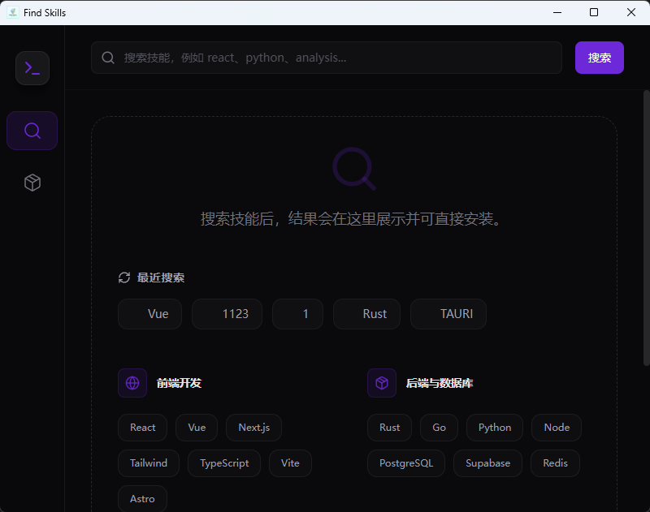

# Find Skill App

中文 | [English](#english)

如果说人类的知识是AI的数据来源，那人类的技能就是AI的另一个宝藏。
让AI寻找技能，使用技能，用好技能很是关键。
市面上有很多技能网站，但是我依然觉得“不够好用”，"不够方便“
所以这款Find Skill App诞生了，用最简单的方式给你的智能体安装技能。

求求了，给孩子一个star吧~我会继续完善这个项目的。



## 功能特性

- 技能搜索：按关键词查询可用 Skills
- 安装引导：支持全局安装与项目级安装
- 已安装管理：查看并刷新已安装 Skills
- 更新能力：检查更新并执行批量更新
- 中英文界面：内置中英文本地化文案

## 技术栈

- Tauri 2
- React 19
- TypeScript
- Vite 7
- Tailwind CSS 4
- Zustand

## 快速开始

### 环境要求

- Node.js 20+
- pnpm 9+
- Rust（稳定版）与 Cargo
- Tauri 依赖（按你的操作系统安装）

### 安装依赖

```bash
pnpm install
```

### 开发模式

```bash
pnpm tauri dev
```

### 构建

```bash
pnpm build
pnpm tauri build
```

## 项目结构

```text
src/          前端页面与业务逻辑
src-tauri/    Rust 后端与 Tauri 配置
public/       静态资源
```

## 开源协作

- 贡献指南：见 [CONTRIBUTING.md](./CONTRIBUTING.md)
- 行为准则：见 [CODE_OF_CONDUCT.md](./CODE_OF_CONDUCT.md)
- 安全策略：见 [SECURITY.md](./SECURITY.md)

## 许可证

本项目使用 [MIT License](./LICENSE)。

---

## English

I find that many people use AI to help them with their daily tasks, but they often find it difficult to use the skills they have installed.
So I decided to create this project to help people install skills easily.

I would be very grateful if you could give this project a star.
I will continue to improve this project.

### Features

- Skill Search: find available skills by keyword
- Guided Install: supports global and project-level installation
- Installed Management: view and refresh installed skills
- Update Flow: check for updates and perform batch updates
- Bilingual UI: built-in Chinese and English localization

### Tech Stack

- Tauri 2
- React 19
- TypeScript
- Vite 7
- Tailwind CSS 4
- Zustand

### Quick Start

#### Prerequisites

- Node.js 20+
- pnpm 9+
- Rust stable toolchain with Cargo
- Tauri system dependencies for your OS

#### Install

```bash
pnpm install
```

#### Run in Development

```bash
pnpm tauri dev
```

#### Build

```bash
pnpm build
pnpm tauri build
```

### Project Structure

```text
src/          frontend code and feature modules
src-tauri/    Rust backend and Tauri configuration
public/       static assets
```

### Open Source Collaboration

- Contributing guide: [CONTRIBUTING.md](./CONTRIBUTING.md)
- Code of conduct: [CODE_OF_CONDUCT.md](./CODE_OF_CONDUCT.md)
- Security policy: [SECURITY.md](./SECURITY.md)

### License

This project is licensed under the [MIT License](./LICENSE).
